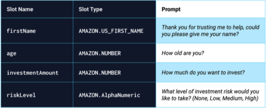

# Roboadvisor

You’ve been hired as a digital transformation consultant by one of the most prominent retirement plan providers in the country. They want to increase their client portfolio—especially by engaging young people. Because machine learning and NLP are disrupting finance to improve the customer experience, you decide to create a robo advisor. Both existing and potentially new customers will be able to use this robo advisor to get investment portfolio recommendations for retirement.

# What You're Creating
In this Challenge, you’ll combine your new AWS skills with your existing Python superpowers to create a bot that will recommend an investment portfolio for a retirement plan.

You’ll be asked to accomplish the following main tasks:

Configure the initial robo advisor: Define an Amazon Lex bot with a single intent that establishes a conversation about requirements to suggest an investment portfolio for retirement.

Build and test the robo advisor: Make sure that your bot works and accurately responds during the conversation with the user.

Enhance the robo advisor with an Amazon Lambda function: Create an Amazon Lambda function that validates the user's input and returns the investment portfolio recommendation. This includes testing the Amazon Lambda function and integrating it with the bot.

These files include the following:

The lambda_function.py file: Starter code for the AWS Lambda function that you’ll create.

The correctDialog.json file: A Lambda test event for a valid dialogue.

The ageError.json file: A Lambda test event with an invalid age.

The incorrectAmountError.json file: A Lambda test event with an invalid investment amount.

The negativeAgeError.json file: A Lambda test event with a negative age.

## Instructions
This section divides the Challenge instructions into the following three steps:

1. Configure the initial robo advisor

Build and test the robo advisor

Enhance the robo advisor with an Amazon Lambda function

### Step 1: Configure the Initial Robo Advisor
In this section, you create the robo advisor bot and add an intent with its corresponding slots. To do so, complete the following steps:

1. Sign in to your AWS Management Console, and then create a new custom Amazon Lex bot (Links to an external site.). Use the following criteria:

    * Bot name: RoboAdvisor
    * Language: English (US)
    * Output voice: Salli
    * Session timeout: 5 minutes
    * Sentiment analysis: No
    * COPPA: No
    * Advanced options: No
    * All other options: The default value

2. Add a new intent, and name it recommendPortfolio.

3. Configure sample utterances as follows (you can add more utterances if you want):

    * I want to save money for my retirement
    * I'm {age} and I would like to invest for my retirement
    * I'm {age} and I want to invest for my retirement
    * I want the best option to invest for my retirement
    * I'm worried about my retirement
    * I want to invest for my retirement
    * I would like to invest for my retirement

4. Create four slots, as the following image specifies:

5. Move to the “Confirmation prompt” section, and then set the following messages:

    * Confirm: Thanks, now I will look for the best investment portfolio for you.
    * Cancel: I will be pleased to assist you in the future.

### Step 2: Build and Test the Robo Advisor
In this section, you build and test your robo advisor. To do so, complete the following steps:

1. To build your bot, click the Build button (in the upper-right corner of the page).

2. When the build finishes, test it in the “Test bot” pane. 

3. Record a video or create an animated GIF of the working bot.

### Step 3: Enhance the Robo Advisor with an Amazon Lambda Function
In this section, you create an Amazon Lambda function to validate the data that a user supplies during a conversation with the robo advisor. To do so, complete the following steps:

1. Create a new Lambda function from scratch, and name it recommendPortfolio. Choose Python 3.7 as the runtime programming language.

2. In the online code editor, delete the AWS-generated default lines of code, and then paste in the provided starter code from lambda_function.py.

3. Complete the recommend_portfolio function by adding the following validation rules:

    * The value of age should be greater than zero and less than 65.
    * The value of investment_amount should be greater than or equal to 5000.

4. Complete the starter code so that once the intent is fulfilled, the bot responds with an investment recommendation based on the selected risk level, as follows:

    * None: “100% bonds (AGG), 0% equities (SPY)”
    * Low: “60% bonds (AGG), 40% equities (SPY)”
    * Medium: “40% bonds (AGG), 60% equities (SPY)”
    * High: “20% bonds (AGG), 80% equities (SPY)”

5. When you finish coding your Lambda function, test it by using the provided test events.

6. After successfully testing your code, open the Amazon Lex console, and then navigate to the recommendPortfolio bot configuration. Integrate your new Lambda function into the bot by selecting it in the “Lambda initialization and validation” and “Fulfillment” sections.

7. Build your bot, and then test it with both valid and invalid data for the slots.

8. Record a video or create an animated GIF of the working bot.

